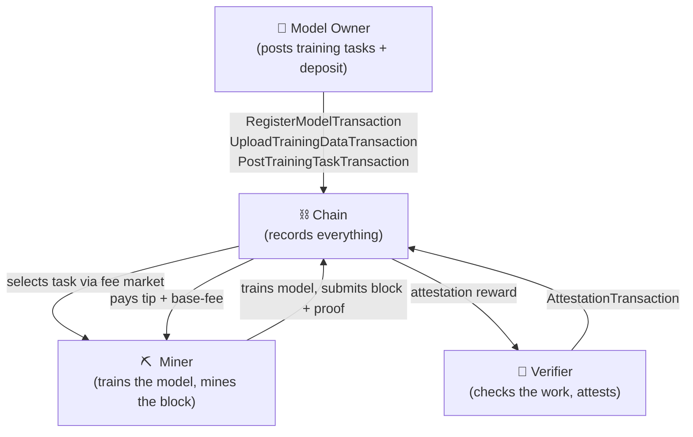
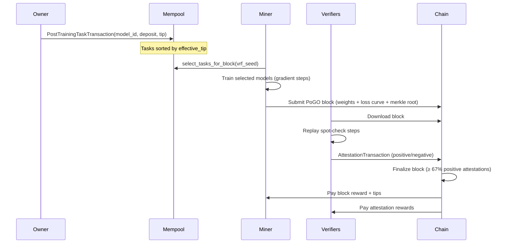

# Chapter 1 — What is DeSSIN?

## The Problem with Training AI Today

Training a large language model (LLM) today requires either:

- **A single giant GPU cluster** owned by one company, or
- **A lot of trust** — you hand your data and money to someone else and hope they train the model you asked for.

Both options have problems. Centralised clusters are expensive, opaque, and a single point of failure. Trusting a third party means you can never verify that the model was actually trained on your data, or that the reported loss curves are real.

> *Can we train AI models in a trustless, decentralised way — the same way Bitcoin mines currency without a central bank?*

DeSSIN answers: **yes**.

---

## The Core Idea

In Bitcoin, miners compete to solve a useless puzzle (finding a hash below a target). The puzzle is hard on purpose so that doing the work proves effort was expended.

DeSSIN replaces the useless puzzle with **real machine-learning work**: training a neural network. Instead of discarding heat, miners produce a trained model that is directly useful.

```
Bitcoin:  Mine block  ──►  Hash puzzle (wastes energy)
DeSSIN:   Mine block  ──►  Train model (produces value)
```

This idea is called **Proof of Gradient Optimisation** (PoGO). We cover it in detail in Chapter 2.

---

## The Key Actors



| Actor | What they do | How they are incentivised |
|---|---|---|
| **Model Owner** | Submits models and datasets; pays a deposit | Gets a trained model |
| **Miner** | Runs training; produces a PoGO block | Earns block reward + tip |
| **Verifier** | Replays a sample of gradient steps; attests | Earns attestation reward |
| **Node** | Stores data; seeds via BitTorrent | Earns storage fees |

Any participant can play multiple roles. A single machine can be a miner, verifier, and storage node simultaneously.

---

## A Single Training Block, Step by Step

Here is what happens between two consecutive blocks:



The whole cycle repeats every block (default: 2 hours for production, 15 seconds for tests).

---

## What Makes It Trustless?

Three mechanisms prevent cheating:

1. **Merkle tree of weights** — the miner commits to every layer of the trained model. Verifiers can challenge any leaf without downloading the full model.

2. **Spot-check verification** — a VRF (Verifiable Random Function) picks a random subset of gradient steps *after* the block is published. The miner cannot know which steps will be checked, so they cannot fake the training.

3. **Slashing** — if a miner submits provably fraudulent work, they lose their stake. This makes cheating unprofitable.

---

## Checkpoint

After this chapter you should understand:
- Why PoGO replaces wasteful hash puzzles with real training work.
- The four actors (owner, miner, verifier, node) and their incentives.
- The high-level flow of a single training block.

Next: **Chapter 2** dives into how PoGO consensus actually works mathematically.
