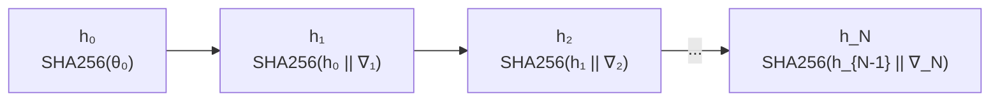
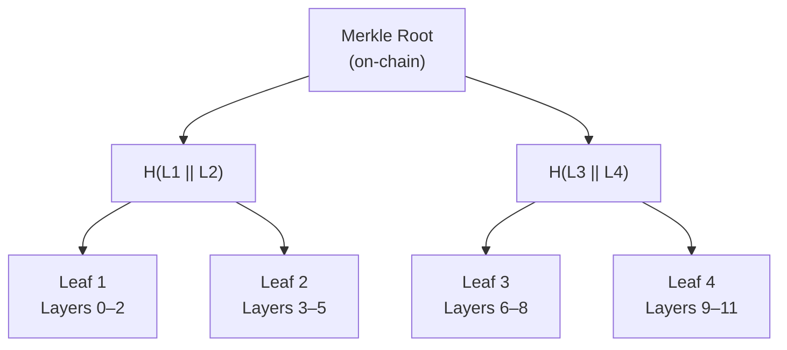
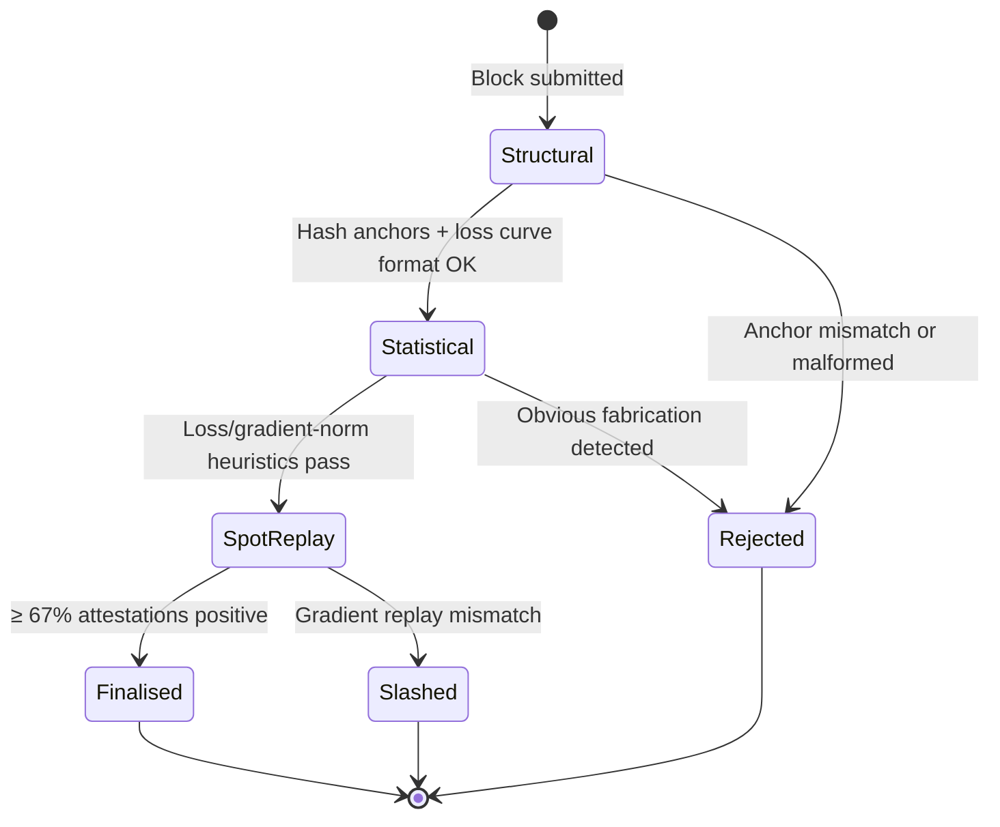

# Chapter 2 — Proof of Gradient Optimisation (PoGO)

## What is a "Proof of Work"?

In Bitcoin, a miner proves they did work by finding a number `nonce` such that:

$$\text{SHA256}(\text{block\_header} \,||\, \text{nonce}) < \text{target}$$

This is just a lottery — you try billions of random numbers until one is lucky. The *proof* is the nonce itself: anyone can verify it in microseconds.

DeSSIN needs the same property — **easy to verify, hard to fake** — but the work must *also* be useful.

---

## The PoGO Insight

Training a neural network means repeatedly computing a gradient and subtracting it from the weights:

$$\theta_{t+1} = \theta_t - \eta \cdot \nabla_\theta \mathcal{L}(\theta_t, \mathcal{D}_t)$$

Where:
- $\theta_t$ — model parameters at step $t$
- $\eta$ — learning rate
- $\mathcal{L}$ — loss function
- $\mathcal{D}_t$ — mini-batch of training data at step $t$

After $N$ steps, the loss should have decreased. This decrease is *hard to fake without actually running the computation*, but *easy to verify* by replaying a small random sample of steps.

That is PoGO in one sentence: **the gradient descent itself is the proof of work.**

---

## Block Structure

A PoGO block contains:

```
PoGO Block
├── block_index         — sequential block number
├── previous_hash       — links to parent block
├── model_id            — which model was trained
├── miner_address       — who did the training
├── training_steps      — number of gradient steps run
├── initial_loss        — loss before training started
├── final_loss          — loss after training finished
├── loss_curve[]        — loss at every step (committed but not stored on-chain)
├── gradient_hash_chain — rolling SHA256 of gradient tensors at each step
├── merkle_root         — root of the Merkle tree over model weight layers
├── vrf_proof           — VRF output used for spot-check selection
└── timestamp
```

The key cryptographic commitments are the **gradient hash chain** and the **Merkle root**.

---

## The Gradient Hash Chain

At each training step $t$, the miner computes:

$$h_t = \text{SHA256}(h_{t-1} \,||\, \text{grad\_tensor}_t)$$

Starting from $h_0 = \text{SHA256}(\text{initial\_weights})$.

This creates a *chain of hashes* that links every gradient update. If you tamper with step 42's gradient, you break the chain from step 42 onwards — verifiers will detect it.



Only $h_N$ goes on-chain. Verifiers ask for specific $h_t$ values and re-derive them to check consistency.

---

## The Merkle Tree of Weights

The trained model $\theta_N$ is split into fixed-size *leaves* (default: 10 MB each). A Merkle tree is built over these leaves:



A verifier can prove that a specific leaf is part of the committed model using a *Merkle proof* — a path of sibling hashes from the leaf to the root. This takes O(log N) hashes, not the full model.

---

## Spot-Check Verification

This is the **primary security mechanism** in DeSSIN. After a block is published, a VRF seed is derived from post-publication chain state (so the miner cannot predict it at mining time):

$$\text{seed} = \text{VRF}(\text{miner\_private\_key},\ \text{block\_hash})$$

This seed selects $k$ random step indices (default: $k = 2$):

$$\{i_1, i_2, \ldots, i_k\} = \text{DrawWithoutReplacement}(\text{seed},\ N,\ k)$$

Each verifier independently replays those steps:

1. Fetch $\theta_{i-1}$ (weights just before that step) from the miner.
2. Re-run forward + backward pass with the same mini-batch $\mathcal{D}_i$.
3. Compare the resulting gradient hash $h_i$ against the miner's committed chain.

If $\geq 67\%$ of verifiers confirm the replays match: **block finalised**.

> **Why only $k=2$ steps?** Full re-training takes hours. Two random steps take seconds. Without knowing which steps will be chosen, a cheater who only faked $m$ of $N$ steps passes with probability $(m/N)^k$. For $N=100, m=2, k=2$ that is $\approx 0.04\%$ — a 99.96% catch rate. Statistical heuristics on the published loss curve and gradient norms add a second independent layer.

The miner commits to every step *before* the challenge is known, so selective fakery is infeasible.

---

## Verification Flow



**Structural checks** (free, immediate): step counts, `state_0_hash` anchors to the previous block's `state_N_hash`, Merkle root presence.

**Statistical heuristics** (cheap): gradient-norm band, max per-step loss-jump ratio, grad-vs-Δloss correlation floor. These flag obvious fabrications (e.g. uniform-random gradient norms) but do not prove honest training on their own.

**Spot replay** (the proof): $k=2$ VRF-chosen gradient steps are independently replayed by each verifier. This is what actually proves training happened.

---

## Slashing

If a miner is caught cheating, they are *slashed*:
- A fraction of their staked DESSIN is burned.
- Their model is frozen (cannot be trained again until the owner refreshes it).

The slashing threshold is configurable (default: 33% of negative attestations triggers slashing). This makes fraud economically rational to report but not to commit.

---

## Dynamic Block Time

Training a 7B model takes much longer than training a micro-GPT. DeSSIN adjusts block time dynamically:

- If verification completes quickly (< 50% of the allocated window), block time **shortens** by up to 5%.
- If verification is slow or timed out, block time **lengthens** by up to 15%.

This asymmetry — gentle shortening, aggressive lengthening — prevents the network from getting stuck when miners are slow.

$$t_{\text{next}} = \text{clamp}\!\left(t_{\text{current}} \times (1 \pm \delta),\ t_{\min},\ t_{\max}\right)$$

where $\delta \in [0.05, 0.15]$ depending on stress level.

---

## Checkpoint

After this chapter you should understand:
- How the gradient hash chain commits to every training step.
- How the Merkle tree commits to the final model weights.
- Why spot-check verification ($k=2$ random replays) is the core security primitive.
- How structural and statistical checks add cheap pre-filters.
- How slashing deters fraud.

Next: **Chapter 3** — the Training Market, where tasks are priced and scheduled.
