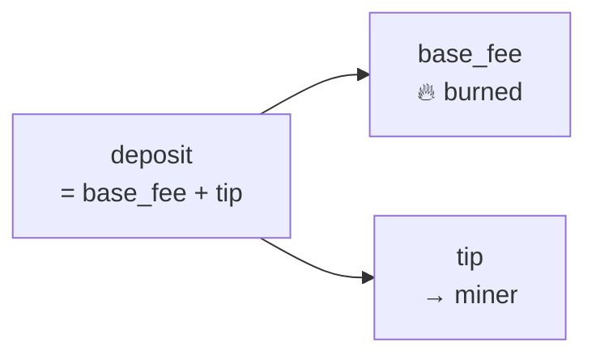
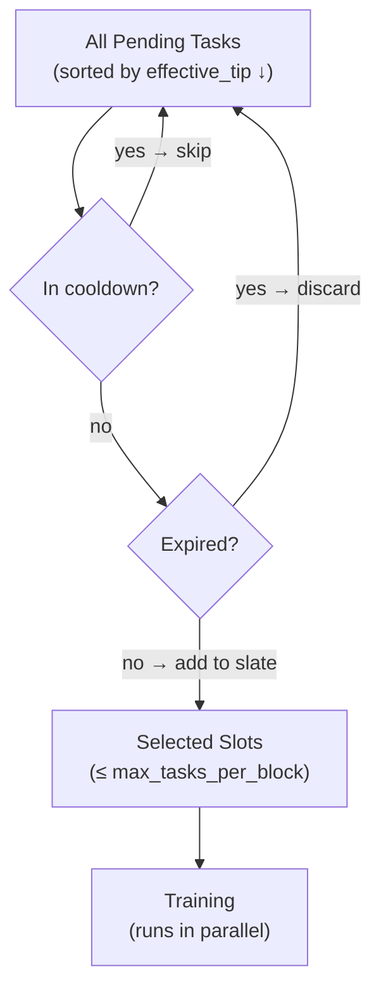
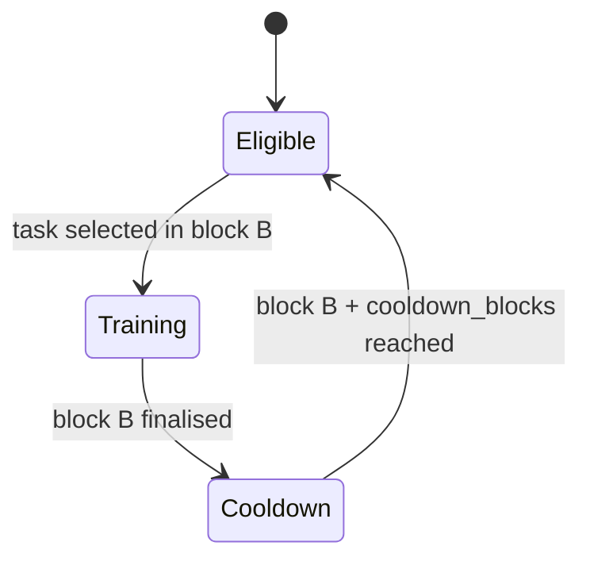

# Chapter 3 — The Training Market

## The Scheduling Problem

A new block arrives every 2 hours. During that window, how does the network decide *which* models get trained?

In the simplest design, you could just take the oldest task. But that ignores urgency — maybe Alice's chatbot has been waiting 10 blocks while Bob just submitted a low-priority research model five minutes ago. And it ignores economics — some users are willing to pay more to jump the queue.

DeSSIN solves this with a **fee market** inspired by Ethereum's EIP-1559 upgrade.

---

## The Gas + Tip Model

Every training task carries two payments inside a single **deposit**:

```
deposit = base_fee + tip
```

| Component | Who sets it | Where it goes | Purpose |
|---|---|---|---|
| `base_fee` | Protocol (auto-adjusts) | Burned | Covers protocol overhead |
| `tip` | Task owner | Miner | Incentivises inclusion |

This mirrors Ethereum's EIP-1559:
- The **base fee** rises when blocks are full and falls when they are empty, targeting 50% slot utilisation.
- The **tip** is pure competition — owners who want faster inclusion offer more.



---

## The Mempool

All submitted tasks wait in a **mempool** (memory pool) until a miner includes them.

Each task is characterised by its **effective tip**:

$$\text{effective\_tip}(t,\ \text{block}) = \underbrace{t.\text{tip}}_{\text{owner offer}} \times \underbrace{u(t,\ \text{block})}_{\text{urgency multiplier}}$$

The **urgency multiplier** $u$ grows linearly with how long the task has been waiting:

$$u(t,\ \text{block}) = \min\!\left(1 + r \cdot (\text{block} - t.\text{submitted\_block}),\ u_{\max}\right)$$

| Parameter | Default | Effect |
|---|---|---|
| $r$ (urgency rate) | 0.10 per block | How fast urgency grows |
| $u_{\max}$ (cap) | 5× | Prevents runaway growth |

> **Example:** A task with `tip = 1.0` submitted 10 blocks ago has:
> $u = 1 + 0.1 \times 10 = 2.0$, so its effective tip is $2.0$.
> A new task with `tip = 1.5` submitted just now has effective tip $1.5$.
> The older, cheaper task wins.

This ensures **no task is starved indefinitely**, regardless of how low its tip is.

---

## Block Leader Selection

The block leader (the miner who won the right to propose the next block) selects tasks using a greedy algorithm:

```
1. Filter: remove expired tasks and models in cooldown
2. Score:  effective_tip = tip × urgency_multiplier(current_block)
3. Sort:   descending by effective_tip
4. Break ties: VRF-derived integer per task (tamper-resistant)
5. Pack:   take top N tasks, max one slot per model per block
```

The slot budget $N$ is set by `max_tasks_per_block` (default: 4). This is the maximum number of models trained in a single block.



---

## VRF Tie-Breaking

When two tasks have the same effective tip, the miner cannot choose arbitrarily — that would let them favour their own tasks or take bribes.

Instead, a tie-breaking integer is derived from the VRF seed and the task ID:

$$\text{tiebreak}(t) = \text{first 8 bytes of SHA256}(\text{vrf\_seed} \,||\, t.\text{task\_id})$$

The miner commits to the VRF output **before** selecting tasks, so they cannot manipulate which tied tasks win.

---

## Cooldowns

After a model is trained, it enters a **cooldown** window. During cooldown, new tasks for that model are rejected:



Default cooldown: **5 blocks**. This prevents a single well-funded owner from monopolising every block.

The cooldown can be set per-task (up to `max_cooldown_blocks = 100`).

---

## Base Fee Adjustment

The base fee adjusts every block like a thermostat:

$$f_{\text{next}} = \text{clamp}\!\left(f_{\text{current}} \times \left(1 + \text{rate} \cdot \frac{u - u^*}{u^*}\right),\ f_{\min},\ f_{\max}\right)$$

Where:
- $u = \text{slots\_used} / \text{max\_tasks\_per\_block}$ — actual utilisation
- $u^* = 0.5$ — target utilisation (50%)
- $\text{rate} = 0.125$ — max change per block (12.5%)

| Block fullness | Effect |
|---|---|
| 4/4 tasks used (100%) | base fee rises ~12.5% |
| 2/4 tasks used (50%) | base fee unchanged |
| 0/4 tasks used (0%) | base fee falls ~12.5% |

This means: if the network is consistently busy, the price of training rises until demand softens. If it is quiet, prices fall to attract more users.

---

## Task Expiry

Tasks do not live in the mempool forever. Each task has an `expiry_block`:

$$\text{expiry\_block} = \text{submitted\_block} + \text{task\_expiry\_blocks}$$

Default: 200 blocks (about 17 days at 2h/block). If a task has not been included by then, it is cancelled and the deposit is refunded minus a small expiry fee.

---

## A Complete Example

Alice wants to fine-tune her 7B model with LoRA. The current base fee is `0.01 DESSIN`. She estimates the compute cost at `0.5 DESSIN` (see Chapter 7) and offers a tip of `0.1 DESSIN` to ensure fast inclusion.

```python
from dessin.consensus.training_market import TrainingMarket, TrainingTaskSpec
from dessin.runtime.config import TrainingMarketConfig

market = TrainingMarket(TrainingMarketConfig())

task = TrainingTaskSpec(
    task_id="alice_lora_001",
    model_id="llama-7b-alice",
    owner="0xAlice",
    deposit=0.61,          # base_fee(0.01) + compute(0.5) + tip(0.1)
    base_fee=0.01,
    tip=0.1,
    cooldown_blocks=5,
    max_slots=1,
    submitted_block=100,
    expiry_block=300,
)

ok, msg = market.submit_task(task, current_block=100)
# ok = True

# 3 blocks later, Alice's urgency multiplier is:
# u = 1 + 0.1 * 3 = 1.3  →  effective_tip = 0.1 * 1.3 = 0.13
```

Bob submits a competing task with `tip = 0.12` at block 103. Alice's effective tip is `0.13`; Bob's is `0.12`. Alice's task is selected first.

---

## Checkpoint

After this chapter you should understand:
- The `deposit = base_fee + tip` structure and where each part goes.
- How the urgency multiplier prevents starvation.
- How the block leader selects tasks and why VRF tie-breaking is needed.
- How cooldowns prevent monopolisation.
- How the base fee auto-adjusts like a thermostat.

Next: **Chapter 4** — supported model formats, what is trainable, and how to register a model.
