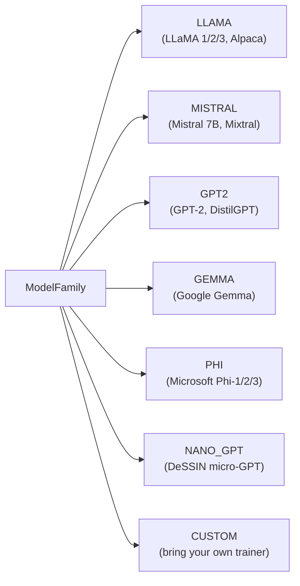
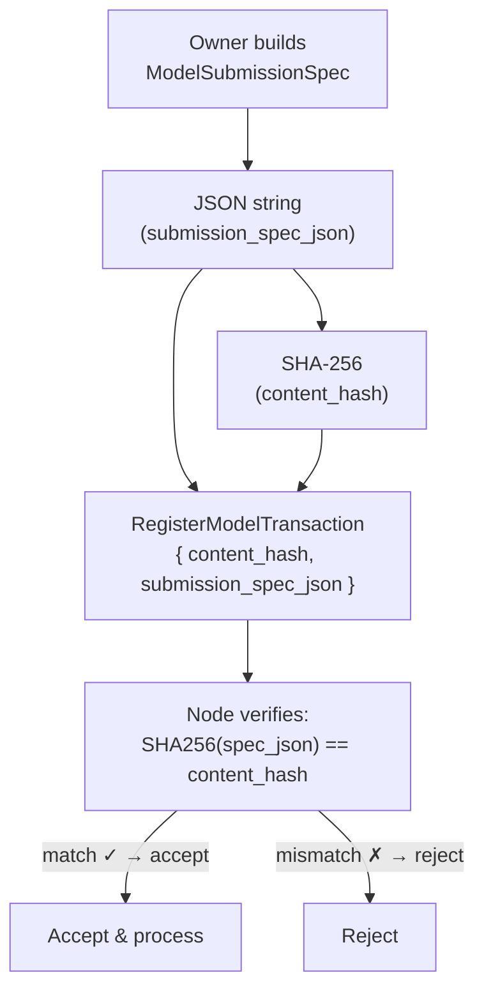

# Chapter 4 — Models & Formats

## Supported Formats

DeSSIN only lists formats that have a **real, tested implementation** backing them. Adding a format to the registry without a working trainer would mislead model owners about what the network can actually do.

Three formats are currently registered:

| Format | Training | Inference | Status |
|---|---|---|---|
| **DESSIN_NATIVE** | ✅ Full PoGO gradient training | ✅ Char LM generation | Fully supported |
| **GGUF** | ❌ Not trainable in-protocol | ✅ Via `llama-cpp-python` | Inference only |
| **SafeTensors** | ❌ Planned (needs `peft`) | ✅ Via HuggingFace | Inference only |

> **Rule:** Do not add a new `ModelFormat` value without a matching trainer module under `dessin/llm/` and passing unit tests that perform real gradient steps.

The `is_trainable` property makes this machine-checkable:

```python
from dessin.models.model_format_registry import dessin_native_preset, gguf_preset

native = dessin_native_preset(n_layer=2, n_head=2, n_embd=64, block_size=32, vocab_size=65)
gguf   = gguf_preset(parameter_count_millions=7000, size_mb=4096)

print(native.is_trainable)  # True
print(gguf.is_trainable)    # False
```

DeSSIN needs to know the format so it can:
1. Decide whether a `PostTrainingTaskTransaction` for this model is valid.
2. Calculate fees (quantised models are cheaper to run).
3. Verify integrity (Merkle proofs are format-aware).

---

## The ModelFormatSpec

At the heart of a model registration is a `ModelFormatSpec` — a data structure that describes everything about the weight file without requiring anyone to download it.

```python
from dessin.models.model_format_registry import (
    ModelFormat, ModelPrecision, ModelFormatSpec,
    HardwareRequirements, GGUFMetadata
)

spec = ModelFormatSpec(
    format=ModelFormat.GGUF,
    precision=ModelPrecision.INT4_K_M,
    parameter_count_millions=7000.0,   # 7 billion parameters
    size_mb=4096.0,                    # ~4 GB on disk
    context_length=4096,
    hardware=HardwareRequirements(
        min_ram_mb=5000,
        supports_cpu_inference=True,
        supports_cuda=True,
    ),
    gguf_metadata=GGUFMetadata(
        architecture="llama",
        context_length=4096,
    ),
)
```

### Precision levels

The precision field describes how weight values are compressed:

```
FP32  ── 32 bits per weight ── full precision (baseline)
FP16  ── 16 bits per weight ── half precision
BF16  ── 16 bits, wider range ── good for training
INT8  ──  8 bits per weight ── 4× smaller than FP32
INT4  ──  4 bits per weight ── 8× smaller, some quality loss
INT4_K_M ── 4-bit k-quant medium ── best quality/size for GGUF
INT2_K  ──  2 bits ── very small, noticeable quality drop
```

Quantised models ($\leq$ INT8) receive a **30% fee discount** because they require less compute per token.

---

## Quick Constructors

DeSSIN provides one-line constructors for each supported format:

```python
from dessin.models.model_format_registry import (
    dessin_native_preset, gguf_preset, safetensors_preset, ModelPrecision
)

# The in-protocol trainable model (DecoderOnlyGPT)
native = dessin_native_preset(
    n_layer=6, n_head=6, n_embd=192,
    block_size=128, vocab_size=65,
)
print(native.is_trainable)   # True

# A GGUF LLaMA-7B (inference-only in-protocol)
gguf = gguf_preset(
    parameter_count_millions=7000,
    size_mb=4096,
    architecture="llama",
)
print(gguf.is_trainable)     # False

# A HuggingFace SafeTensors Mistral-7B (inference-only in-protocol)
st = safetensors_preset(
    parameter_count_millions=7000,
    size_mb=13_700,     # unquantised BF16
    precision=ModelPrecision.BF16,
    num_layers=32,
    hidden_size=4096,
)
print(st.is_trainable)       # False
```

> **Why no MLX constructor?** MLX is Apple-Silicon-only and requires a separate runtime. DeSSIN nodes run on heterogeneous hardware, so MLX cannot be required in-protocol. MLX models can still be *imported* as GGUF or SafeTensors for inference.

---

## Registering a Model

A model is registered by posting a `RegisterModelTransaction` on-chain. It carries:

1. The full `ModelSubmissionSpec` (format + pipeline) as a JSON string.
2. A SHA-256 **content hash** of that JSON (so no one can tamper with the spec in transit).
3. A `required_deposit` — the DESSIN locked for the first training cycle.
4. A `storage_payment` — the DESSIN locked to keep the weights available on the network.

```python
import json
from dessin.models.model_format_registry import (
    ModelSubmissionSpec, ModelFamily, TrainingPipelineSpec, PipelineStageSpec
)
from dessin.models.model_submission_transactions import RegisterModelTransaction
from dessin.economics.compute_fee_schedule import ComputeFeeSchedule, TrainingPhase

# 1. Build the submission spec
pipeline = TrainingPipelineSpec(name="lora-sft")
pipeline.add_stage(PipelineStageSpec(
    stage_index=0,
    method="lora",
    dataset_id="my_dataset_hash_abc123",
    max_steps=2000,
    lora_rank=16,
    lora_alpha=32,
))

submission = ModelSubmissionSpec(
    model_name="MyNanoGPT-LoRA",
    owner="0xAlice",
    family=ModelFamily.NANO_GPT,
    format_spec=native,        # dessin_native_preset — trainable in-protocol
    pipeline=pipeline,
    tags=["nano-gpt", "dessin-native", "lora"],
)

# 2. Validate before submitting
errors = submission.validate()
assert errors == [], f"Spec errors: {errors}"

# 3. Estimate the deposit
schedule = ComputeFeeSchedule()
deposit = schedule.estimate_pipeline_fee(
    size_mb=submission.format_spec.size_mb,
    stages=[s.to_dict() for s in submission.pipeline.stages],
    is_quantized=submission.format_spec.is_quantized,
)
# e.g. for a 10 MB nano-GPT with 2000 LoRA steps (FP32):
# deposit ≈ 0.00035 × 10 × (2000/1000) × 1.0 ≈ 0.007 DESSIN

# 4. Build the transaction
tx = RegisterModelTransaction(
    sender="0xAlice",
    fee=0.01,
    timestamp=...,
    public_key="...",
    signature="...",
    tx_id="...",
    model_name=submission.model_name,
    family=submission.family.value,
    format=submission.format_spec.format.value,
    size_mb=submission.format_spec.size_mb,
    parameter_count_millions=submission.format_spec.parameter_count_millions,
    content_hash=submission.content_hash(),
    submission_spec_json=json.dumps(submission.to_dict()),
    required_deposit=deposit,
    storage_blocks=500,
    storage_payment=0.05,   # 10 MB × 0.00005 × 100 blocks = 0.05
)
```

### Why store `content_hash` separately?

When a node receives the transaction, it recomputes the hash from `submission_spec_json` and checks it matches `content_hash`. If someone tampers with the JSON in transit, the hash will not match and the transaction is rejected.

This is the same principle as a software package checksum — you trust the hash, not the download source.

---

## Model Families

The `ModelFamily` enum tells verifiers which architecture is being trained, so they can instantiate the right trainer:



---

## The Content Hash as an Integrity Anchor



---

## Checkpoint

After this chapter you should understand:
- Why only `DESSIN_NATIVE` is trainable in-protocol and what `is_trainable` means.
- The role of `GGUF` and `SafeTensors` as inference-only formats (for now).
- How `ModelFormatSpec` captures what a model file looks like without downloading it.
- How to build a `ModelSubmissionSpec` and validate it.
- Why the `content_hash` is essential for tamper-proof registration.

Next: **Chapter 5** — fine-tuning pipelines: LoRA (pure PyTorch), QLoRA, and multi-stage training.
