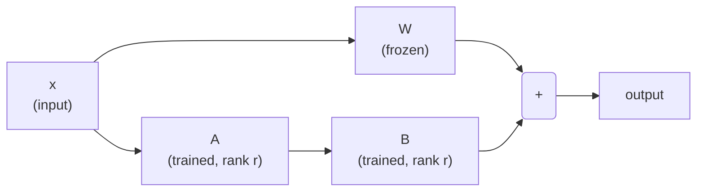
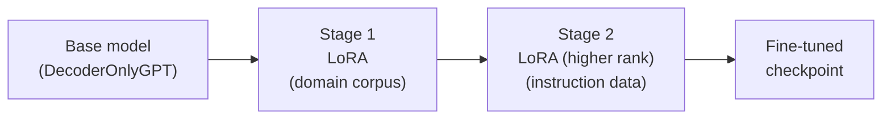
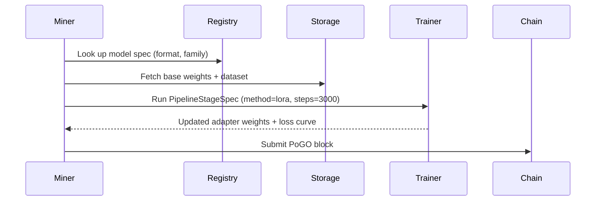

# Chapter 5 — Fine-Tuning Pipelines

## What is Fine-Tuning?

A pre-trained model like LLaMA-7B already knows a lot about language — grammar, facts, reasoning patterns. But it was trained to predict the next token on the internet, not to answer your specific questions politely.

**Fine-tuning** adapts a pre-trained model for a specific task by continuing training on a curated, smaller dataset. Think of it as going from a generalist to a specialist.

```
Pre-trained LLaMA-7B
  "I can predict any text."
         │
         │  fine-tune on customer-service transcripts
         ▼
Fine-tuned LLaMA-7B
  "I answer customer questions politely."
```

---

## The Cost Problem

Full fine-tuning updates every one of the 7 billion parameters. This is expensive:

| Model | Params | Full FT (FP32) VRAM needed |
|---|---|---|
| GPT-2 Small | 117 M | ~2 GB |
| LLaMA-7B | 7 000 M | ~112 GB |
| LLaMA-70B | 70 000 M | ~1 120 GB |

That last number requires dozens of A100 GPUs. Most people cannot afford that. This is why **parameter-efficient fine-tuning** (PEFT) techniques were invented.

---

## LoRA — Low-Rank Adaptation

LoRA is the most popular PEFT technique. Instead of updating the full weight matrix $W \in \mathbb{R}^{d \times k}$, it learns two small *adapter* matrices $A$ and $B$:

$$W' = W + \Delta W = W + BA$$

where:
- $B \in \mathbb{R}^{d \times r}$ and $A \in \mathbb{R}^{r \times k}$
- $r \ll \min(d, k)$ — the **rank** (typically 4–64)

The original $W$ is frozen. Only $A$ and $B$ are trained. Since $r$ is small, the number of trainable parameters drops dramatically:

$$\text{saved} = 1 - \frac{2r}{d + k}$$

For a $4096 \times 4096$ matrix with rank 16:

$$\text{saved} = 1 - \frac{2 \times 16}{4096 + 4096} \approx 99.6\%$$



---

## QLoRA — Quantised LoRA

QLoRA goes a step further: it loads the base model in 4-bit precision (INT4) to save memory, while training LoRA adapters at full precision (FP16).

$$\text{memory} \approx \frac{\text{params} \times 4\text{bits}}{8\text{bits/byte}} + \text{adapter overhead}$$

A 7B model loaded in INT4 needs about 3.5 GB VRAM — enough for a single consumer GPU.

The trade-off: quantised base weights introduce a small approximation error. For most fine-tuning tasks this barely affects quality, but for mathematical reasoning it can matter.

---

## All Available Methods

| Method | What is updated | Memory | Quality |
|---|---|---|---|
| `full` | All parameters | ★★★★★ | ★★★★★ |
| `sft` (full, supervised) | All params, supervised | ★★★★★ | ★★★★★ |
| `dpo` | All params, preference | ★★★★★ | ★★★★★ |
| `rlhf` | All params + reward model | ★★★★★ | ★★★★★ |
| `lora` | Adapters only | ★★ | ★★★★ |
| `qlora` | Adapters on INT4 backbone | ★ | ★★★★ |
| `adapter` | Small bottleneck layers | ★★ | ★★★ |
| `prompt_tuning` | Soft prompt tokens | ★ | ★★★ |
| `prefix_tuning` | Prefix activations | ★ | ★★★ |

★ = low resource use / quality; ★★★★★ = high.

---

## LoRA on DeSSIN — Pure PyTorch, No Extra Deps

DeSSIN ships a **built-in LoRA trainer** (`dessin/llm/lora_trainer.py`) that runs on top of `DecoderOnlyGPT` using only PyTorch — no `peft`, no `accelerate`, no downloads required.

```python
from dessin.llm.lora_trainer import LoRAConfig, train_lora
from dessin.llm.decoder_only_gpt import DecoderOnlyGPT, CharTokenizer
from dessin.llm.decoder_lm_training import BUNDLED_SHAKESPEARE_CHAR_CORPUS

# Build the base model
model = DecoderOnlyGPT(vocab_size=65, block_size=32, n_layer=2, n_head=2, n_embd=64)

# Configure LoRA: freeze base, train rank-8 adapters on Q/K/V and output proj
cfg = LoRAConfig(rank=8, alpha=16.0, target_modules={"qkv", "proj"})

result = train_lora(
    model, BUNDLED_SHAKESPEARE_CHAR_CORPUS, cfg,
    steps=500, batch_size=4, learning_rate=3e-4,
)

print(f"Loss: {result.initial_loss:.3f} → {result.final_loss:.3f}")
print(f"Trained {result.trainable_params:,} / {result.total_params:,} params "
      f"({result.param_efficiency:.1%})")

# result.training_result.model_weights_hex  ← merged hex, PoGO-compatible
```

The adapters are **merged back into the base weights** before export, so the output checkpoint is binary-compatible with any code that uses `load_params_from_hex` on a plain `DecoderOnlyGPT`.

## Multi-Stage Pipelines

A **pipeline** is an ordered sequence of fine-tuning stages. Each stage takes the output of the previous one as its starting checkpoint.

A common recipe on DeSSIN (all stages trainable with `DESSIN_NATIVE` format):



In DeSSIN, you describe this pipeline in a `TrainingPipelineSpec`:

```python
from dessin.models.model_format_registry import TrainingPipelineSpec, PipelineStageSpec

pipeline = TrainingPipelineSpec(
    name="assistant-recipe",
    description="LoRA SFT followed by DPO alignment",
)

# Stage 0 — Supervised Fine-Tuning with LoRA
pipeline.add_stage(PipelineStageSpec(
    stage_index=0,
    method="lora",
    dataset_id="instruction_data_hash",
    max_steps=3000,
    learning_rate=2e-4,
    lora_rank=16,
    lora_alpha=32,
))

# Stage 1 — Direct Preference Optimisation
pipeline.add_stage(PipelineStageSpec(
    stage_index=1,
    method="dpo",
    dataset_id="preference_pairs_hash",
    max_steps=1000,
    learning_rate=5e-5,
))
```

Each stage references a **dataset ID** — this is the hash of a training data file uploaded via `UploadTrainingDataTransaction` (covered in Chapter 6).

---

## Fee Estimation for a Pipeline

The total cost of a pipeline is the sum of all stage costs:

$$\text{total\_fee} = \sum_{s \in \text{stages}} \text{estimate\_training\_fee}(s.\text{size\_mb},\ s.\text{phase},\ s.\text{max\_steps})$$

Using the `ComputeFeeSchedule`:

```python
from dessin.economics.compute_fee_schedule import ComputeFeeSchedule

schedule = ComputeFeeSchedule()

total = schedule.estimate_pipeline_fee(
    size_mb=4096,           # model weight size
    stages=[s.to_dict() for s in pipeline.stages],
    is_quantized=True,      # QLoRA discount applies
)
print(f"Estimated pipeline cost: {total:.4f} DESSIN")
# Stage 0: 4096 × 0.00035 × (3000/1000) × 0.7 = 3.00 DESSIN
# Stage 1: 4096 × 0.0012  × (1000/1000) × 0.7 = 3.44 DESSIN
# Total: ~6.44 DESSIN
```

---

## How the Miner Executes a Stage

When a miner picks up a task, it looks up the stage spec and runs the appropriate trainer:



The miner is free to choose which LoRA/QLoRA implementation it uses internally, as long as the output passes verification. This keeps the protocol open to new training frameworks.

---

## Checkpoint

After this chapter you should understand:
- How LoRA dramatically reduces the number of trainable parameters.
- When to use QLoRA vs. full fine-tuning.
- How to build a multi-stage pipeline with `TrainingPipelineSpec`.
- How pipeline fees are calculated as a sum of stage costs.

Next: **Chapter 6** — storage leases: paying for data and what happens when you stop.
