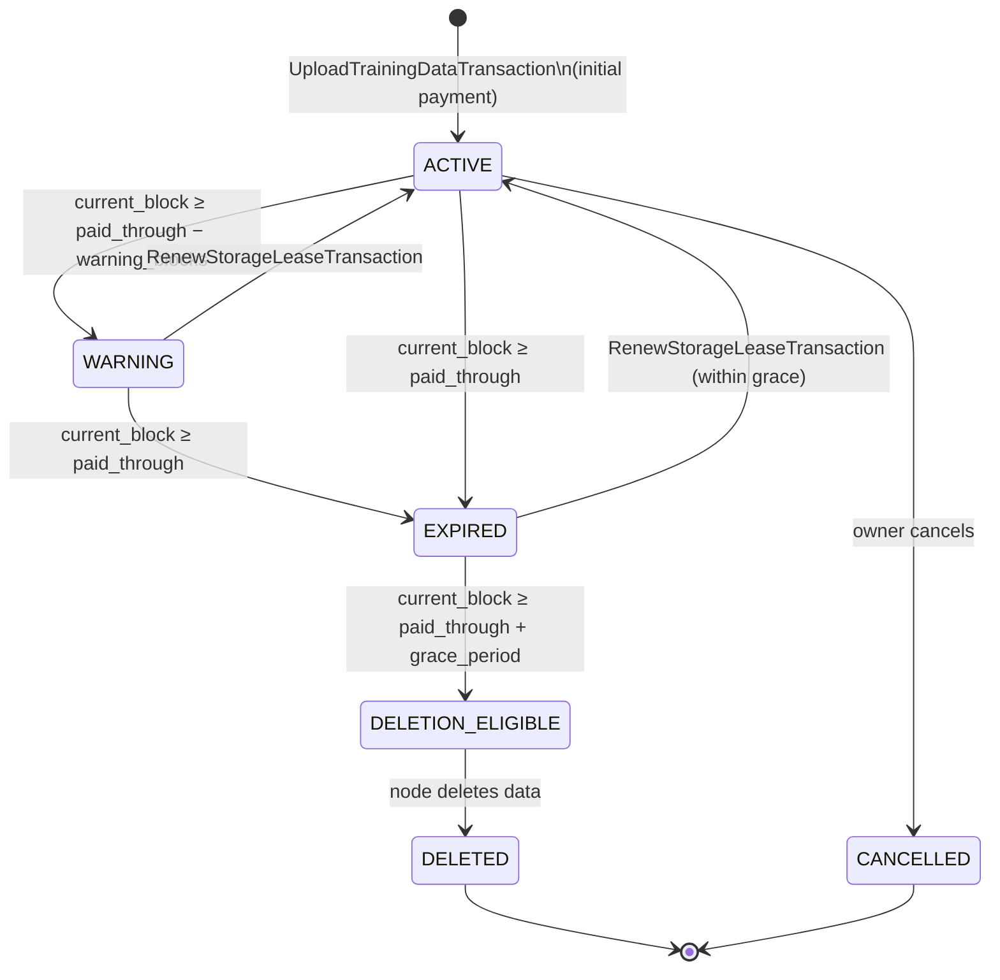
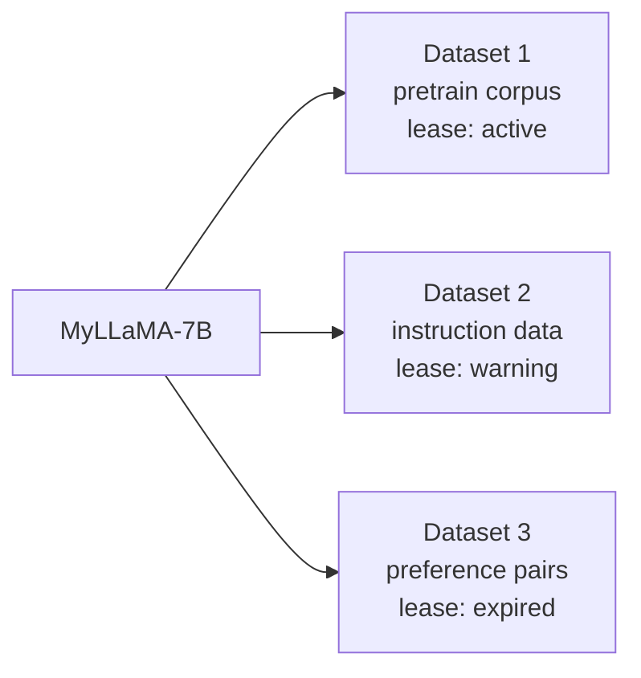

# Chapter 6 — Storage Leases

## The Problem with Free Storage

Imagine you upload a 50 GB training dataset to DeSSIN and never pay anything after that. Every node in the network has to store your data forever — for free. Nobody would run a node.

DeSSIN solves this with **storage leases**: a time-limited, paid commitment that says *"keep my data available until block N."*

If you stop paying, nodes are allowed to delete your data after a grace period. This is similar to how Filecoin and Arweave work, but integrated directly into DeSSIN's blockchain.

---

## The Lease Lifecycle

Every uploaded file has a lease that moves through these states:



| State | Meaning |
|---|---|
| `ACTIVE` | Paid and safe — nodes must keep the data |
| `WARNING` | Expiry approaching — owner should renew soon |
| `EXPIRED` | Lease has run out — grace period running |
| `DELETION_ELIGIBLE` | Grace period over — nodes may delete |
| `DELETED` | Data physically removed |
| `CANCELLED` | Owner voluntarily cancelled |

---

## Uploading Training Data

To upload a dataset, the owner posts an `UploadTrainingDataTransaction`:

```python
from dessin.models.model_submission_transactions import UploadTrainingDataTransaction
from dessin.economics.compute_fee_schedule import ComputeFeeSchedule

schedule = ComputeFeeSchedule()
size_mb = 512.0   # 512 MB dataset

# How much to pay for 200 blocks of storage?
storage_cost = schedule.estimate_storage_renewal_fee(size_mb=size_mb, blocks=200)
# 512 × 0.00005 × 200 = 5.12 DESSIN

tx = UploadTrainingDataTransaction(
    sender="0xAlice",
    fee=0.01,
    timestamp=...,
    public_key="...",
    signature="...",
    tx_id="...",
    file_id="sha256_of_file_bytes",
    model_id="my_llama_model_id",
    file_name="instructions_v2.jsonl",
    file_hash="sha256_of_file_bytes",
    size_mb=size_mb,
    dataset_type="sft",         # "pretrain", "sft", "dpo", "rlhf", "eval"
    storage_blocks=200,
    storage_payment=5.12,
)
```

When this transaction is included in a block, the protocol:
1. Debits `storage_payment` from Alice's account.
2. Creates a `StorageLease` with `paid_through_block = current_block + 200`.
3. Nodes begin seeding the data via BitTorrent.

---

## Renewing a Lease

Anyone — not just the owner — can renew a lease. This allows communities and DAOs to collectively fund datasets they care about.

```python
from dessin.models.model_submission_transactions import RenewStorageLeaseTransaction

tx = RenewStorageLeaseTransaction(
    sender="0xCommunityDAO",
    fee=0.001,
    timestamp=...,
    public_key="...",
    signature="...",
    tx_id="...",
    file_id="sha256_of_file_bytes",   # same as the original upload
    additional_blocks=500,
    payment=12.80,   # 512 × 0.00005 × 500
)
```

Renewal extends `paid_through_block` by `additional_blocks`. If the lease was in `WARNING` or `EXPIRED` state, it jumps back to `ACTIVE`.

---

## The Warning Window

The warning window is a buffer before expiry. When `current_block ≥ paid_through_block − warning_blocks` (default: 10 blocks before expiry), the lease transitions to `WARNING`.

This gives the owner time to act before data is lost:

```
Block 100   — Lease created, paid_through = 200
Block 190   — WARNING: "lease expires in 10 blocks"
Block 200   — EXPIRED: grace period starts (50 blocks)
Block 250   — DELETION_ELIGIBLE: nodes may delete
```

The default grace period of **50 blocks** (≈ 4 days at 2h/block) is generous. A node that deletes data before `DELETION_ELIGIBLE` is considered misbehaving and can be slashed.

---

## Pricing

Storage costs are priced per megabyte per block:

$$\text{cost} = \text{size\_mb} \times r_{\text{storage}} \times \text{blocks}$$

where $r_{\text{storage}} = 0.00005\ \text{DESSIN / MB / block}$ (default).

| File size | Storage blocks | Cost |
|---|---|---|
| 100 MB | 100 blocks (~8 days) | 0.50 DESSIN |
| 512 MB | 200 blocks (~17 days) | 5.12 DESSIN |
| 10 000 MB (10 GB) | 500 blocks (~42 days) | 250.00 DESSIN |

Uploading a file also incurs a flat **upload fee** (one-time):

$$\text{upload\_fee} = \text{size\_mb} \times r_{\text{upload}}$$

where $r_{\text{upload}} = 0.0002\ \text{DESSIN / MB}$.

---

## What Happens When Data is Deleted?

If a dataset's lease expires and is not renewed:

1. Nodes transition the lease to `DELETION_ELIGIBLE`.
2. Each node deletes the file from local storage.
3. BitTorrent peers stop seeding.
4. Any training tasks referencing this `dataset_id` will **fail** at execution time (the miner cannot fetch the data).

> **Implication:** Before posting a `PostTrainingTaskTransaction` with `dataset_id = X`, always verify that the lease for `X` is active and will remain active through the expected execution block. The `ComputeFeeSchedule` can help estimate this:

```python
from dessin.economics.storage_lease import StorageLeaseManager

mgr = StorageLeaseManager()
# ... (populated from chain state)

# Check if the dataset will still be alive at the expected training block
expiring = mgr.expiring_soon(current_block=150, within_blocks=30)
for lease in expiring:
    print(f"WARNING: {lease.file_id} expires at block {lease.paid_through_block}")
```

---

## Multiple Files per Model

A model can have multiple associated datasets — for example, one for pre-training, one for SFT, one for DPO. Each has its own independent lease:



In the `TrainingPipelineSpec`, each stage references a `dataset_id`. Only stages whose dataset is `ACTIVE` (or renewed) can be executed.

---

## Community Funding Model

The open renewal policy enables an interesting governance pattern:

- A popular open-source dataset (e.g., a curated instruction dataset) is uploaded once.
- Multiple model owners reference it in their pipelines.
- The community funds the lease cooperatively so no single party bears the full cost.
- If interest drops, the lease expires naturally and storage is reclaimed.

This is similar to how public goods funding works in Ethereum's Gitcoin ecosystem, but automated through the storage lease mechanism.

---

## Checkpoint

After this chapter you should understand:
- The five states of a storage lease and what triggers each transition.
- How to upload a dataset with a storage commitment.
- How to renew a lease (as owner or community member).
- How pricing scales with file size and duration.
- The consequences of letting a lease expire.

Next: **Chapter 7** — the DESSIN economy: tokens, rewards, and the big picture.
