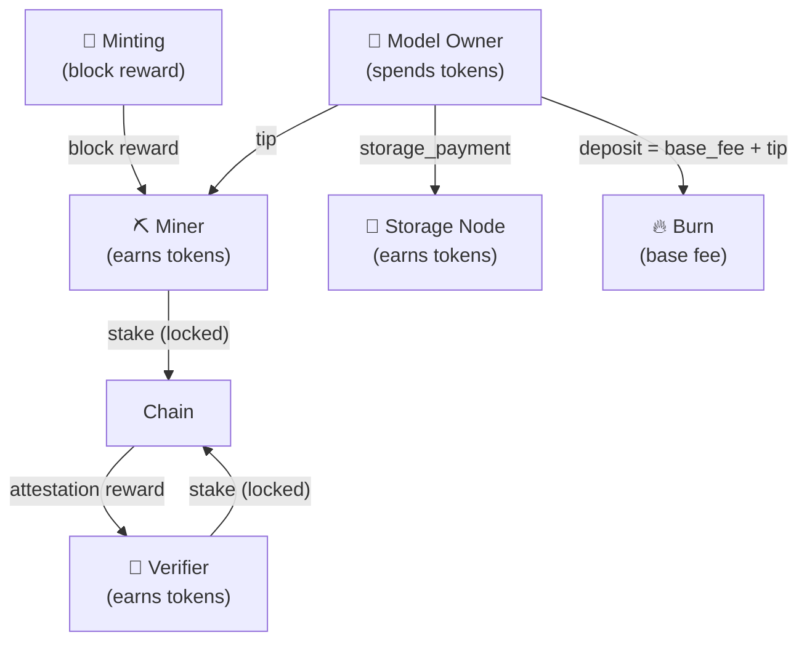
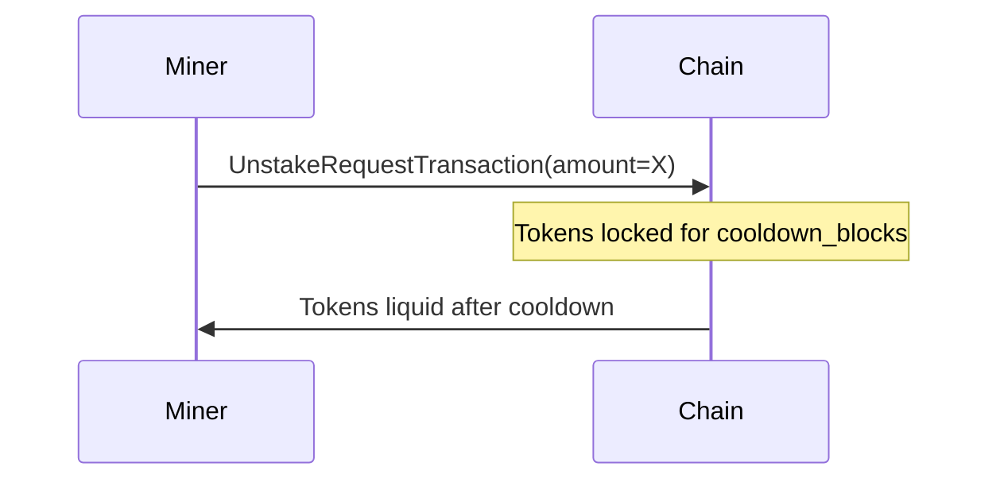
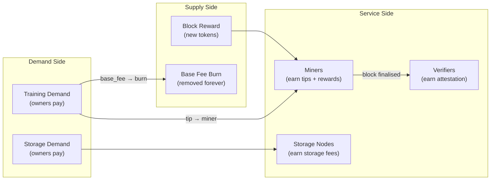

# Chapter 7 — The DESSIN Economy

## Money in a Decentralised Network

Any network of strangers needs money to coordinate. Miners will not train your model for free; nodes will not store your data for free; verifiers will not check blocks for free.

DeSSIN uses a native token — **DESSIN** — as the unit of account for all economic activity. This chapter explains how tokens are created, how they flow between actors, and how the system stays balanced over time.

---

## Token Supply

DeSSIN starts with an initial supply of **1 000 000 DESSIN**.

New tokens are minted as **block rewards** when a miner successfully finalises a training block. The emission rate follows a schedule designed to reward early participation heavily and taper off as the network matures:

| Period | Annual emission rate | Tokens/year |
|---|---|---|
| Bootstrap (first 50 blocks) | 24% | ~240 000 |
| Post-bootstrap | 12% | ~120 000 |

$$\text{reward per block} = \frac{\text{annual\_rate} \times \text{total\_supply}}{365 \times 24 \times 3600 / \text{block\_time\_seconds}}$$

At a 2-hour block time ($t = 7200\ s$):

$$\text{reward} = \frac{0.12 \times 1\,000\,000}{8760 / 2} = \frac{120\,000}{4380} \approx 27.4\ \text{DESSIN/block}$$

---

## The Bootstrap Period

The first 50 blocks are a **bootstrap period** designed to onboard early miners without requiring them to hold large amounts of DESSIN:

- Every registering miner receives a **virtual stake** of 10 000 DESSIN (locked, non-transferable during bootstrap).
- The virtual stake makes them eligible to mine immediately.
- When bootstrap ends, miners who have not been slashed receive a **materialisation grant** of 100 000 DESSIN, converting their virtual stake to real tokens.

This lowers the barrier to entry and prevents the network from being dominated by a small number of wealthy early participants.

---

## Where Tokens Come From and Where They Go

Every token has a clear origin (minting or owner payment) and a clear destination (miner, verifier, node, or burn).

---

## Revenue Streams for Miners

A miner earns from three sources per block:

| Source | Amount | Notes |
|---|---|---|
| Block reward | ~27.4 DESSIN | Fixed per-block emission |
| Tips | Σ `tip` for each scheduled task | Competitive |
| Storage fees | `size_mb × storage_rate × blocks_stored` | Passive income |

The tip revenue is the miner's incentive to select high-tip tasks. As the protocol matures and block rewards decrease, tips become the dominant income — exactly as happened in Ethereum after the merge.

---

## Fee Categories

The `ComputeFeeSchedule` defines fees for every economic action:

### Training fees

$$f_{\text{train}} = \text{size\_mb} \times r_{\text{phase}} \times \frac{\text{steps}}{1000} \times q$$

Where:
- $r_{\text{phase}}$ — per-MB rate for the training phase (see table below)
- $q$ — quantisation discount (0.7 for quantised models, 1.0 for full precision)

| Phase | $r_{\text{phase}}$ |
|---|---|
| Pre-training | 0.003000 |
| Full fine-tune | 0.001000 |
| RLHF | 0.002000 |
| DPO | 0.001200 |
| SFT | 0.000800 |
| LoRA | 0.000350 |
| QLoRA | 0.000250 |
| Prompt tuning | 0.000150 |

### Storage fees

$$f_{\text{upload}} = \text{size\_mb} \times 0.0002$$

$$f_{\text{storage}} = \text{size\_mb} \times 0.00005 \times \text{blocks}$$

### Worked example

Alice trains a 7B GGUF model (4096 MB, INT4-K-M) with LoRA for 2000 steps, with 200 blocks of storage for a 512 MB dataset:

| Item | Calculation | Cost |
|---|---|---|
| LoRA training | $4096 \times 0.00035 \times 2.0 \times 0.7$ | 2.00 DESSIN |
| Dataset upload | $512 \times 0.0002$ | 0.10 DESSIN |
| Dataset storage (200 blocks) | $512 \times 0.00005 \times 200$ | 5.12 DESSIN |
| Protocol fee (tx fees) | fixed | 0.01 DESSIN |
| **Total** | | **7.23 DESSIN** |

At a token price of $0.10, this is **$0.72** — competitive with centralised fine-tuning APIs.

---

## Staking and Slashing

Miners and verifiers must **stake** DESSIN as a security deposit. Staking has two effects:

1. **Skin in the game** — if you misbehave, you lose your stake.
2. **Eligibility** — only staked nodes can mine or verify.

The slashing rules:

| Violation | Penalty |
|---|---|
| Submitting fake gradients | Stake slashed (fraction configurable, default 33%) |
| Submitting inconsistent Merkle proof | Full slashing |
| 3 consecutive failures without improvement | Model frozen (not a slash, but revenue loss) |

A slashed miner can re-register with a fresh stake after a cooldown period.

---

## Unstaking

Exiting the network is not instant. An `UnstakeRequestTransaction` begins a **cooldown** of `unstake_cooldown_blocks` (default: 2 blocks in tests, longer in production). During cooldown, the tokens are locked — this prevents a miner from submitting fraudulent work and immediately withdrawing their stake before slashing can happen.

---

## The Training Market and Token Velocity

The **base fee burn** mechanism is the key to long-term token stability.

When blocks are full:
- Base fee rises → owners pay more → more tokens burned
- Fewer tokens in circulation → token scarcity increases

When blocks are empty:
- Base fee falls → owners pay less → less burning
- More tokens in circulation → token supply relaxes

This creates a **negative feedback loop** that keeps the effective price of training relatively stable over time, regardless of token price fluctuations. It mirrors Ethereum's EIP-1559 deflationary mechanism.

---

## Summary: The Full Token Flow

---

## Checkpoint

After this chapter you should understand:
- How DESSIN tokens are minted via block rewards and what the emission schedule looks like.
- The three revenue streams for miners (reward, tips, storage).
- How training fees are calculated for every phase.
- Why the base fee burn creates long-term supply stability.
- How staking, slashing, and unstaking protect the network from fraud.

---

## Further Reading

- [Chapter 2](chapter_02_pogo_consensus.md) — deep dive into gradient hash chains and spot-check verification.
- [Chapter 3](chapter_03_training_market.md) — urgency multipliers and the EIP-1559 fee market in detail.
- [Chapter 6](chapter_06_storage_leases.md) — storage lease lifecycle and pricing.

---

*This concludes the guided tour of DeSSIN. The codebase lives under `dessin/` — start with `dessin/consensus/` for the protocol layer and `dessin/economics/` for the token mechanics.*
